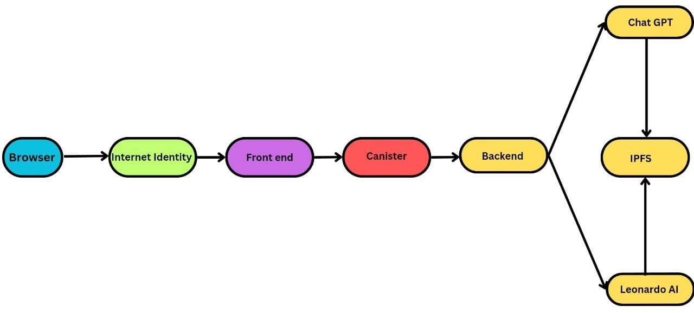

  <div align="center">
  <h1>TaleBlox</h1>
  <p>
    <strong>Craft stories, mint NFTs, reward authors on Internet Computer Protocol</strong>
  </p>

</div>

TaleBlox is your portal to boundless creativity. Craft compelling narratives and effortlessly transform them into captivating NFT art. Reward authors, explore limitless storytelling possibilities, and celebrate the fusion of words and visuals in the world of TaleBlox.

We bridges storytelling and art like never before. With AI-powered enhancements and Leonardo AI, your stories evolve into stunning NFT art pieces. Dive into the world of TaleBlox, where narratives extend beyond words and art leaps off the canvas, all within a vibrant NFT storytelling community.

# Features

* **Story Crafting:** TaleBlox offers a user-friendly interface powered by state-of-the-art AI. Craft your stories effortlessly with creative prompts and intuitive editing tools.

* **NFT Art Generation:** Seamlessly create NFT artwork that complements your narratives. Our AI-driven image generation engine, powered by Leonardo AI, brings your stories to life with stunning visuals.

* **Author Rewards:** Incentivize writers by rewarding them with NFT tokens linked to their stories. This feature encourages content creation and community engagement.

* **Prompt Safety Checks:** Your safety is our priority. TaleBlox includes robust prompt safety checks, leveraging ChatGPT, to ensure a secure and enjoyable experience for all users.

# Architecture



## Components 

* **Browser:** The browser is the user's entry point into TaleBlox. Users access the Dapp through their web browser, where they can interact with the frontend interface, create stories, generate NFT art, and engage with the platform's features.

* **Internet Identity:** Internet Identity serves as the secure authentication mechanism for TaleBlox. It ensures that users can sign in securely, protecting their data and interactions within the Dapp.

* **Frontend:** The frontend of TaleBlox is the user-facing interface. It provides an intuitive and interactive platform for users to craft stories, generate NFT art, and manage their interactions within the Dapp. The frontend communicates with the backend and interacts with the Internet Identity component to ensure a seamless user experience.

* **Canister:** The Canister of TaleBlox is built using Motoko. It handles user data, story creation, NFT minting, and author rewards. It acts as the bridge between the frontend and backend components, ensuring that user actions are processed securely and efficiently.

* **ChatGPT:** ChatGPT plays a crucial role in ensuring the safety of user-generated prompts within TaleBlox.

* **Leonardo AI:** Leonardo AI is an integral component responsible for generating NFT art based on the stories created within TaleBlox. It utilizes advanced AI algorithms to transform textual narratives into visually stunning artworks, enhancing the storytelling experience.

# Local Installation

1. Clone the repository

First, you need to clone the repository

```
https://github.com/Destiny-01/TaleBlox-ICP
```

2. Install Dependencies

Install the project's dependencies using Yarn:

```
yarn install
```

3. Start the Project

Once all the dependencies are installed, you can start the project:

```
yarn dev
```

The project should now be running on `http://localhost:3000`

# Usage

* Visit TaleBlox in your web browser and securely sign in using Internet Identity to access the platform.
* Click "Create Story" to start crafting your narratives. Utilize AI-enhanced prompts and editing tools to shape your stories.
* Explore the "Generate NFT Art" feature to automatically transform your stories into visually stunning NFT artworks, powered by Leonardo AI.
* To incentivize content creators, mint NFT tokens linked to their stories by selecting "Mint NFT." This process celebrates and rewards authors.
* Immerse yourself in the TaleBlox community, share your stories, collect NFTs, and celebrate the fusion of storytelling and art. Your creative journey begins here.

# Canister documentation 

## Types

**Story**

A Story is represented by the following fields:

* **id:** A unique identifier for the story.
* **title:** The title of the story.
* **initialAuthor:** The author of the first page of the story.
* **pageCount:** The total number of pages in the story.
* **pages:** An array of Page objects representing the story's pages.
* **owner:** The principal of the story's owner.

**Page**

A Page is represented by the following fields:

* **id:** A unique identifier for the page.
* **author:** The author of the page.
* **prompt:** The prompt for the page.
* **content:** The content of the page.
* **image:** The URL of the associated image.

**NFT**

An NFT is used to represent the index of a story associated with an NFT.

## Actor Class

The TaleBlox actor class is the core component of the canister, responsible for managing stories and NFTs. It contains functions for creating stories, contributing to stories, and minting NFTs.

## Functions

* **createStory(id, title, prompt, content, imageUrl, metadataUrl)**
This function allows users to create a new story with the specified parameters. It mints an NFT for the associated image and initializes the story.

* **contributeToStory(storyId, prompt, content, imageUrl, metadataUrl)**
Users can contribute to existing stories using this function. It also mints NFTs for associated images and adds a new page to the story.

* **getAllStories()**
This query function returns a list of all existing stories.

## Minting NFTs
Minting NFTs is done internally within the canister. The mintImageAsNFT private function is responsible for this process. It should take a metadata URL as input and return true if successful or false if there's an error.

## Queries
The canister supports a single query function, getAllStories, which allows users to retrieve a list of all available stories.

# Troubleshooting 

* **Check Internet Connection**

Before attempting any troubleshooting steps, ensure that you have a stable and active internet connection. Internet Identity relies on a connection to the Internet to function correctly.

* **Supported Browsers**

Internet Identity is designed to work with modern web browsers. Make sure you are using a supported browser such as Google Chrome, Mozilla Firefox, or Microsoft Edge. Ensure your browser is up-to-date.

* **Clear Browser Cache**

Cached data in your browser can sometimes cause issues. Try clearing your browser cache and cookies. Instructions for doing this vary depending on your browser, so consult your browser's documentation.

* **Identity Provider Issues**

Internet Identity relies on identity providers like DFINITY Foundation's Identity Provider (IDP). If the IDP experiences downtime or issues, it can affect your ability to log in. Check the status of the identity provider, if possible.

# Contribution Guidelines

We welcome contributions from anyone who would like to help improve our dapp.

To contribute, please follow the following steps:

1. Fork the repository to your own GitHub account: https://github.com/Destiny-01/TaleBlox-ICP
2. Create a new branch from the main branch for your changes.
3. Make your changes and commit them with clear commit messages.
4. Push your changes to your forked repository.
5. Open a pull request to merge your changes into the main branch.

# Team Members

* Aigbe Destiny
* Kushal Sapra
* Chukwunonso Iwenor
* Marvellous Aigbe
* Sinachi Ajuzie

# Acknowledgements

We would like to acknowledge the following individuals and resources for their contributions and support:
* **Internet Computer Protocol:** The foundation of TaleBlox relies on the Internet Computer Protocol (ICP), enabling the secure and decentralized nature of our Dapp.
* **OpenAI:** Our sincere thanks to OpenAI for the incredible GPT-3.5 model that powers the prompt safety checks and story generation in TaleBlox.
* **Leonardo AI:** We acknowledge Leonardo AI for its exceptional image generation capabilities, bringing our stories to life as stunning NFT art.
* **Storychain** We'd like to express our gratitude to the creators of "Storychain" for their innovative contributions to the blockchain storytelling domain. Their work has inspired and informed our development efforts for TaleBlox.
